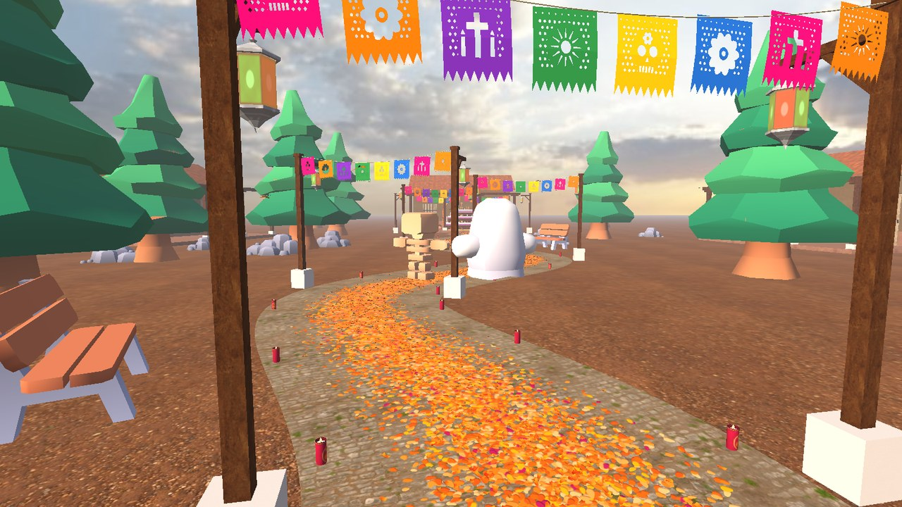
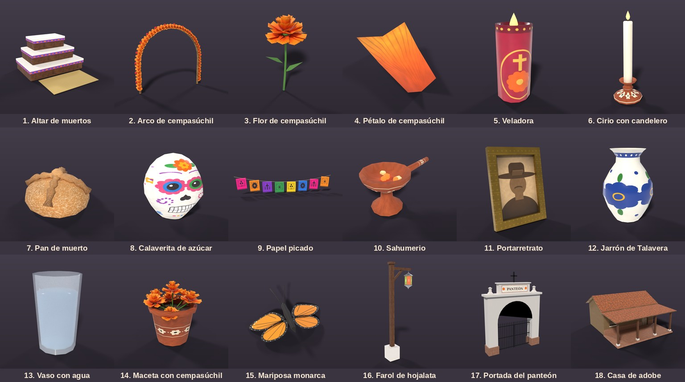

# Camino de Cempasúchil — Altar de Día de Muertos interactivo

Proyecto final de **Computación Gráfica e Interacción Humano-Computadora**
Facultad de Ingeniería, UNAM — Semestre 2027-1 — Prof. Ing. José Ramón Pérez Athié



## Descripción

Sistema gráfico interactivo en 3D (C++17, **OpenGL 3.3 core** y **GLSL 3.30**) sobre la temática
**México y su cultura**: la noche de Día de Muertos en un pueblo. Un **camino de pétalos de
cempasúchil** sale del panteón, pasa entre faroles de hojalata, veladoras y tiras de papel picado,
y guía a las ánimas hasta la **ofrenda de tres niveles** instalada en el portal de una casa de adobe.

El proyecto aplica el pipeline gráfico completo: conceptualización, modelado geométrico y
jerárquico, análisis de color, texturizado, iluminación, sombreado, animación, interacción y
renderizado, optimizando en todo momento los recursos (modelos *low-poly*, instanciado por GPU,
texturas compartidas y pequeñas, descarte por *frustum*).

## Estado por entrega

| Entrega | Fecha | Estado |
|---|---|---|
| 1. Prototipo | 29 de septiembre de 2026 | Entregado: altar de 3 niveles con primitivas en Blender (`Prototipo/`) |
| 2. Modelado | 13 de octubre de 2026 | **Esta entrega**: 18 modelos propios + 25 de librería integrados en OpenGL, grafo de escena jerárquico, transformaciones interactivas ([documento](docs/entrega2_modelado.md)) |
| 3. Texturizado, color e iluminación | 27 de octubre de 2026 | Texturas y skybox ya integrados; pendientes Phong, Fresnel y luces interactivas |
| 4. Animación | 5 de noviembre de 2026 | Modelos ya preparados con pivotes (alas, banderitas, rejas, flamas) |

La matriz completa de requisitos del documento de especificaciones y su avance está en
[docs/requisitos.md](docs/requisitos.md).

## Características de la entrega de modelado

- **18 modelos propios** creados en Blender 5.2 mediante *scripts* de modelado procedural
  (`Modelado/scripts/`): altar, arco de cempasúchil, flor, pétalo, veladora, cirio, pan de muerto,
  calaverita de azúcar, papel picado, sahumerio, portarretrato, jarrón de Talavera, vaso con agua,
  maceta, mariposa monarca, farol, portada del panteón y casa de adobe. Todos con UVs y textura.
- **25 modelos de librería** (Kenney *Graveyard Kit*, CC0): tumbas, lápidas, cruces, criptas,
  rejas, bardas, cipreses, calabazas, personajes, etc.
- **Modelado jerárquico** en los modelos (altar → nivel 1 → nivel 2 → nivel 3; poste → brazo →
  lámpara → flama; cordel → banderitas; cuerpo → alas) y en la escena (casa → ofrenda → altar →
  niveles → ofrendas).
- **Transformaciones geométricas** interactivas: selección con el ratón (rayo contra cajas
  envolventes y triángulos), inspector con traslación, rotación y escala, y visualización de las
  matrices local y de mundo (`M = T · R · S`).
- **Modelado procedural**: camino trazado con una spline Catmull-Rom centrípeta, 7 000 pétalos
  instanciados en una sola llamada de dibujo, alfombra de pétalos, veladoras y faroles alineados
  al camino.
- **Galería de modelos** con pedestal giratorio, estadísticas y jerarquía de cada modelo.
- Texturas propias generadas desde cero + texturas CC0, y **skybox** con *cube map*.



## Compilación

Las dependencias van incluidas en `external/` (no se necesita internet): GLFW 3.4, GLAD
(OpenGL 3.3 core), GLM 1.0.1, cgltf 1.15, stb_image 2.30 y Dear ImGui 1.91.9b.

### Windows con Visual Studio 2022

1. Instalar Visual Studio 2022 con la carga de trabajo **Desarrollo para el escritorio con C++**
   (incluye CMake).
2. *Archivo → Abrir → Carpeta…* y elegir la carpeta del repositorio. Visual Studio detecta el
   `CMakeLists.txt`.
3. Elegir la configuración **x64-Release**, el destino `CaminoCempasuchil.exe` y compilar
   (*Compilar → Compilar todo*).
4. El ejecutable queda junto a las carpetas `assets/`, `shaders/` y `readme.txt` (se copian al
   compilar), lista para empaquetar con InstallForge.

También desde la línea de comandos:

```bat
cmake -S . -B build -G "Visual Studio 17 2022" -A x64
cmake --build build --config Release
build\Release\CaminoCempasuchil.exe
```

El ejecutable enlaza el *runtime* de C++ de forma estática, así que no necesita DLL adicionales.

### Linux

```bash
sudo apt install build-essential cmake libx11-dev libxrandr-dev libxinerama-dev libxcursor-dev libxi-dev libgl-dev
cmake -S . -B build -DCMAKE_BUILD_TYPE=Release
cmake --build build -j
./build/CaminoCempasuchil
```

## Controles

| Tecla / ratón | Acción |
|---|---|
| `W A S D`, `Q / E` | Moverse; bajar / subir |
| `Shift` / `Ctrl` | Más rápido / más lento |
| Clic derecho + ratón | Mirar alrededor (en la galería: orbitar) |
| Rueda | Velocidad de la cámara (galería: acercar) |
| Clic izquierdo | Seleccionar objeto (`Ctrl` + clic: pieza exacta) |
| Flechas, `RePág`, `AvPág` | Trasladar el objeto seleccionado |
| `Z / X`, `C / V` | Rotar sobre Y; reducir / aumentar escala |
| `Retroceso`, `N`, `F` | Restablecer; seleccionar el padre; enfocar |
| `1` … `7` | Vistas predefinidas |
| `G` | Galería de modelos (flechas para cambiar, `Espacio` para girar) |
| `F1` / `F2` / `F3` / `F4` | Ayuda / alambre / resaltar selección / ocultar interfaz |
| `F12` o `P` | Captura de pantalla |

## Estructura del repositorio

```
├── CMakeLists.txt          proyecto de CMake (Visual Studio, MinGW, Linux)
├── readme.txt              instrucciones de instalación y uso (se distribuye con el .exe)
├── src/                    código C++ (render/, scene/, interfaz)
├── shaders/                GLSL 3.30 (escena, cielo, líneas)
├── assets/
│   ├── models/propios/     18 modelos glTF del equipo
│   ├── models/libreria/    25 modelos Kenney Graveyard Kit (CC0)
│   ├── textures/           texturas propias y CC0 compartidas
│   ├── skybox/atardecer/   6 caras del cube map
│   └── fuentes/            fuente de la interfaz (SIL OFL)
├── Modelado/
│   ├── scripts/            modelado procedural en Blender, texturas y figuras
│   └── blend/              archivos .blend de cada modelo
├── Prototipo/              entrega 1 (altar con primitivas)
├── docs/                   documentación de entregas, requisitos e imágenes
├── tools/                  capturas y diagramas para la documentación
└── external/               bibliotecas de terceros
```

## Temática

**México y su cultura** — La festividad indígena dedicada a los muertos, inscrita por la UNESCO en
la Lista Representativa del Patrimonio Cultural Inmaterial de la Humanidad (2008).

## Equipo

- Basilio Illescas Andres — Product Owner
- Trejo Olvera Emmanuel — Scrum Master
- Pérez Olvera Alexis Abraham — Developer
- Cruz Macedo Samuel Santiago — Developer

## Créditos de terceros

- Modelos: [Kenney — Graveyard Kit 5.0](https://kenney.nl/assets/graveyard-kit) (CC0).
- Texturas y cielo: [Poly Haven](https://polyhaven.com) (CC0). Detalle en
  [assets/CREDITOS.md](assets/CREDITOS.md).
- Bibliotecas: ver [external/README.md](external/README.md).
