# Entrega 2 — Modelado

**Proyecto:** Camino de Cempasúchil — Altar de Día de Muertos interactivo
**Asignatura:** Computación Gráfica e Interacción Humano-Computadora, Facultad de Ingeniería, UNAM
**Profesor:** Ing. José Ramón Pérez Athié · **Semestre:** 2027-1
**Fecha de entrega:** 13 de octubre de 2026

**Equipo:** Basilio Illescas Andres · Trejo Olvera Emmanuel · Pérez Olvera Alexis Abraham ·
Cruz Macedo Samuel Santiago

---

## Contenido

1. [Resumen](#1-resumen)
2. [Planteamiento y alcance de la entrega](#2-planteamiento-y-alcance-de-la-entrega)
3. [Diseño conceptual](#3-diseño-conceptual)
4. [Herramientas y tecnologías](#4-herramientas-y-tecnologías)
5. [Modelado geométrico de los modelos propios](#5-modelado-geométrico-de-los-modelos-propios)
6. [Modelos de librería](#6-modelos-de-librería)
7. [Modelado jerárquico](#7-modelado-jerárquico)
8. [Transformaciones geométricas](#8-transformaciones-geométricas)
9. [Modelado procedural de la escena](#9-modelado-procedural-de-la-escena)
10. [Optimización de recursos](#10-optimización-de-recursos)
11. [Pruebas internas](#11-pruebas-internas)
12. [Resultados](#12-resultados)
13. [Trabajo para las siguientes entregas](#13-trabajo-para-las-siguientes-entregas)
14. [Referencias](#14-referencias)
15. [Anexo A. Fichas de los modelos propios](#anexo-a-fichas-de-los-modelos-propios)

---

## 1. Resumen

En esta entrega el prototipo de altar construido con primitivas (entrega 1) evoluciona a un
entorno completo modelado en Blender e integrado en un programa propio escrito en C++17 con
OpenGL 3.3 core y GLSL 3.30. Se modelaron **18 modelos propios** mediante *scripts* de modelado
procedural (superficies de revolución, extrusión de contornos, barrido de perfiles, deformación
de vértices y tarjetas con recorte alfa), todos con coordenadas UV y textura, y se integraron
**25 modelos de librería** con licencia CC0. La escena representa un pueblo en Día de Muertos: un
camino de pétalos de cempasúchil, trazado con una spline Catmull-Rom, une el panteón con la
ofrenda de tres niveles colocada en el portal de una casa de adobe. La escena se organiza en un
grafo jerárquico de 553 nodos en el que cada transformación local se compone con la de su padre,
y el usuario puede seleccionar cualquier objeto con el ratón y modificar su traslación, rotación
y escala mientras observa sus matrices local y de mundo. Los recursos se optimizaron con modelos
de bajo número de polígonos (13 382 triángulos para los 18 modelos propios), dibujo instanciado
(7 000 pétalos en una sola llamada de dibujo), texturas compartidas de 128 a 512 píxeles y
descarte por volumen de visión, de modo que la escena completa se mantiene entre 118 y 459
llamadas de dibujo por cuadro y se ejecuta en tiempo real incluso con renderizado por software.

## 2. Planteamiento y alcance de la entrega

El documento de especificaciones pide, para el primer prototipo de software gráfico, trabajar
**diseño, modelado geométrico y modelado jerárquico, y transformaciones geométricas**
(lineamiento 2), y entre los requisitos mínimos del proyecto incluye la **integración de al menos
8 modelos 3D de librerías** y de **8 modelos creados por los participantes**, con **texturizado
demostrable** en estos últimos. La Tabla 1 resume cómo se atendió cada punto en esta entrega.

**Tabla 1.** Alcance de la entrega de modelado.

| Pide el documento | Qué se entrega | Dónde |
|---|---|---|
| Diseño | Concepto, plano de la escena, boceto de la interfaz y flujo de interacción (sección 3) | `docs/img/diseno/` |
| Modelado geométrico | 18 modelos propios con UVs y materiales; 3 mallas procedurales | `Modelado/`, `assets/models/propios/` |
| Modelado jerárquico | Jerarquías dentro de los modelos y grafo de escena de 553 nodos | `src/scene/SceneNode.*`, `src/scene/Escena.cpp` |
| Transformaciones geométricas | Inspector interactivo de traslación, rotación y escala con matrices | `src/App.cpp`, `src/Interfaz.cpp` |
| ≥ 8 modelos de librería | 25 modelos de Kenney *Graveyard Kit* (CC0) | `assets/models/libreria/` |
| ≥ 8 modelos propios | 18 modelos | `Modelado/scripts/modelos/` |
| Texturizado demostrable en modelos propios | 16 texturas propias + 8 CC0 aplicadas con mapeo UV | `assets/textures/` |
| OpenGL 3 o superior | OpenGL 3.3 core, GLSL 3.30 | `shaders/` |

El prototipo de la entrega 1 (Figura 1) tenía 27 objetos, 10 006 triángulos y colores planos; la
misma idea de altar de tres niveles se conservó, pero ahora forma parte de un recorrido completo
que da sentido a la tradición: el camino de flores que guía a las ánimas desde el panteón hasta
la ofrenda del hogar (Brandes, 2006; UNESCO, 2008).

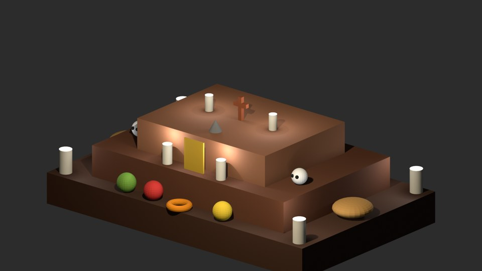

**Figura 1.** Prototipo de la entrega 1: altar de tres niveles construido con primitivas en
Blender (`Prototipo/Untitled.blend`).

## 3. Diseño conceptual

### 3.1 Concepto y distribución

La escena se organiza de norte a sur (Figura 2): al norte la **casa de adobe** con su portal y la
**ofrenda** (altar, arco de cempasúchil, fotografías, pan, calaveritas, veladoras, sahumerio y
cruz de pétalos); al centro el **camino de cempasúchil** de 33 m, flanqueado por veladoras,
faroles de hojalata y tiras de papel picado; al sur el **panteón** con su portada, tumbas
adornadas, criptas, cruz atrial y cipreses. Una calaca y un ánima recorren el camino hacia la
ofrenda y varias mariposas monarca, asociadas al regreso de las almas, revolotean sobre él.

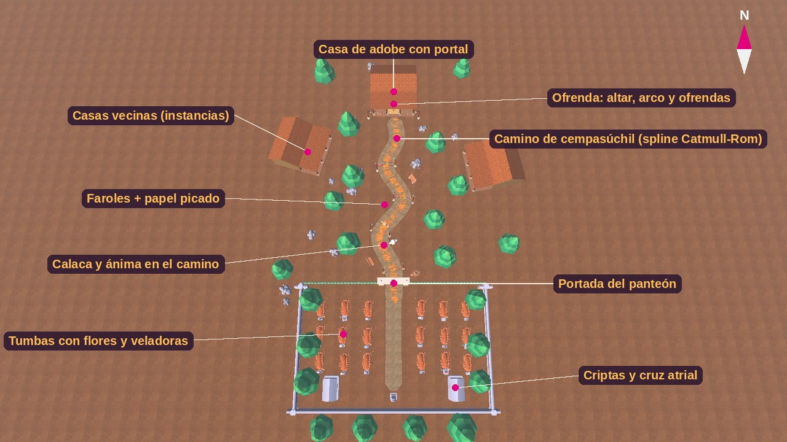

**Figura 2.** Plano de la escena obtenido con la vista aérea del programa (vista 7) y anotado con
`tools/generar_diagramas.py`.

La paleta de color se tomó de la tradición: naranja y amarillo del cempasúchil, rosa mexicano y
morado del papel picado, blanco de las calaveritas, azul cobalto de la Talavera y los tonos de
barro, adobe, cal y teja de la arquitectura vernácula. El análisis de color detallado forma
parte de la entrega 3.

### 3.2 Boceto de la interfaz

La interfaz (Figura 3) se diseñó para que la vista 3D ocupe la mayor parte de la pantalla y los
paneles se puedan ocultar con `F4`. En el **modo escena** hay un panel principal (rendimiento,
modo, vistas y visualización), el inspector de transformaciones y el árbol de la jerarquía. En el
**modo galería** el modelo elegido gira sobre un pedestal y el panel derecho muestra sus datos.

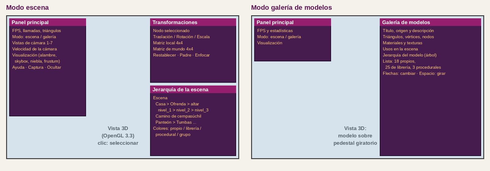

**Figura 3.** Boceto (*wireframe*) de la interfaz en sus dos modos.

### 3.3 Flujo de interacción

La Figura 4 muestra el flujo de interacción. Todas las acciones tienen atajo de teclado y control
en pantalla, y la ayuda (`F1`) está disponible en todo momento.

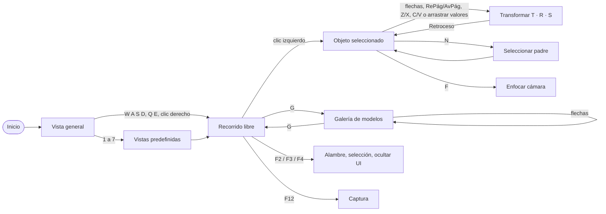
```mermaid
flowchart LR
    A([Inicio]) --> B[Vista general]
    B -->|1 a 7| C[Vistas predefinidas]
    B -->|W A S D, Q E, clic derecho| D[Recorrido libre]
    C --> D
    D -->|clic izquierdo| E[Objeto seleccionado]
    E -->|flechas, RePág/AvPág, Z/X, C/V o arrastrar valores| F[Transformar T · R · S]
    F -->|Retroceso| E
    E -->|N| G[Seleccionar padre]
    G --> E
    E -->|F| H[Enfocar cámara]
    D -->|G| I[Galería de modelos]
    I -->|flechas| I
    I -->|G| D
    D -->|F2 / F3 / F4| J[Alambre, selección, ocultar UI]
    D -->|F12| K[Captura]
```

**Figura 4.** Flujo de interacción del usuario.

## 4. Herramientas y tecnologías

Se eligieron herramientas libres, ligeras y portables; la Tabla 2 justifica cada una desde el
punto de vista del consumo de recursos.

**Tabla 2.** Herramientas y tecnologías.

| Herramienta | Versión | Uso | Motivo |
|---|---|---|---|
| Blender | 5.2.2 | Modelado, UVs, materiales, exportación glTF y renders | Misma versión del prototipo; API de Python para modelar con *scripts* reproducibles |
| Python + Pillow + numpy | 3.13 | Texturas propias, skybox, inventario y figuras | Texturas generadas desde cero, sin licencias de terceros |
| C++17 + CMake | 3.16+ | Programa principal | Compila en Visual Studio 2022, MinGW y GCC |
| OpenGL / GLSL | 3.3 core / 3.30 | Renderizado | Requisito del documento; funciona en gráficas integradas |
| GLFW | 3.4 | Ventana y entrada | Pequeña, multiplataforma |
| GLAD | 0.1.36 | Carga de funciones OpenGL | Generada solo para 3.3 core sin extensiones |
| GLM | 1.0.1 | Matrices, vectores y cuaterniones | Solo encabezados, misma convención que GLSL |
| cgltf | 1.15 | Lectura de glTF 2.0 | Un solo archivo; glTF es binario y compacto |
| stb_image | 2.30 | PNG y JPEG | Un solo archivo, solo los decodificadores usados |
| Dear ImGui | 1.91.9b | Interfaz | Modo inmediato, sin dependencias |

El formato **glTF 2.0** (The Khronos Group, 2021) se eligió porque guarda la jerarquía de nodos,
los materiales PBR, las coordenadas UV y, para la entrega 4, las animaciones y los esqueletos, en
búferes binarios que se copian directamente a la GPU sin procesar texto.

## 5. Modelado geométrico de los modelos propios

### 5.1 Flujo de trabajo

Cada modelo es un *script* de Python en `Modelado/scripts/modelos/` con una función
`construir()`. El programa `construir_modelos.py` lo ejecuta dentro de Blender, guarda el archivo
fuente `.blend`, exporta a glTF y renderiza dos vistas previas (con textura y de malla de
alambre). Las convenciones comunes son: metros como unidad, origen en el centro de la base, frente
hacia −Y en Blender (+Z en OpenGL) y un nodo propio con su pivote para cada pieza que se animará.

### 5.2 Técnicas de modelado

La Tabla 3 relaciona cada técnica con los modelos que la usan; todas están implementadas en
`Modelado/scripts/mx.py`.

**Tabla 3.** Técnicas de modelado geométrico.

| Técnica | Descripción | Modelos |
|---|---|---|
| Superficie de revolución (torno) | Un perfil 2D (radio, altura) gira alrededor de Z con *n* lados; la coordenada *v* se calcula por longitud de arco para no estirar la textura | veladora, cirio, sahumerio, jarrón de Talavera, vaso, maceta, pan de muerto, flama, farol |
| Barrido de perfil (tubo) | Un círculo recorre una polilínea con marcos de transporte paralelo; el radio puede variar | arco (carrizo), huesitos del pan, cordel del papel picado, tallos, mango del sahumerio, antenas |
| Extrusión de contorno cóncavo | Contorno 2D extruido y triangulado por recorte de orejas | muro con arco de medio punto de la portada |
| Muro con vanos | Descomposición del muro en una retícula de celdas que omite los vanos y agrega jambas | casa de adobe (puerta y ventana) |
| Deformación de vértices | Esfera de baja resolución deformada con funciones de caída suave | calaverita (mandíbula, pómulos, cuencas de ojos y nariz) |
| Tarjetas con recorte alfa | Cuadriláteros subdivididos y curvados con textura con transparencia | pétalos, papel picado, alas de la mariposa, hojas |
| Instanciado dentro del modelo | Una pieza se repite con matrices distintas y se combina en una sola malla | flores del arco y de la maceta, anillos de pétalos de la flor |
| Biselado | Chaflán de un segmento en aristas verticales | niveles del altar |

### 5.3 Mapeo UV y texturas

Todas las caras tienen coordenadas UV. Se usaron proyecciones cilíndricas (objetos de
revolución, con *u* = 0.5 al frente para que los motivos queden de frente), proyección por caras
escalada en metros (arquitectura, para que la densidad de textura sea uniforme), proyección plana
frontal combinada con cilíndrica (calaverita) y UVs explícitas por celda de atlas (papel picado y
mariposa). La Figura 5 muestra las 24 texturas: 16 creadas por el equipo con
`generar_texturas.py` (ruido fractal y dibujo vectorial con supermuestreo) y 8 texturas de
dominio público de Poly Haven reducidas a 512 × 512.

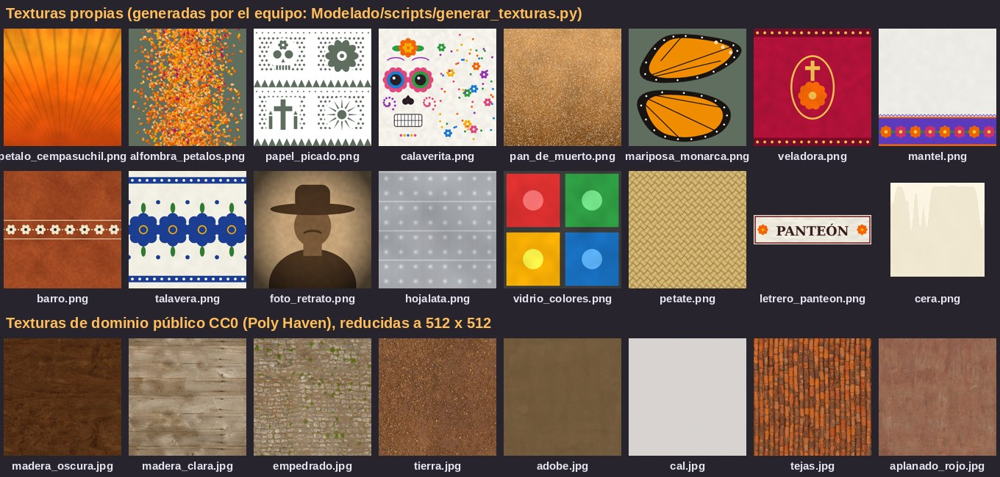

**Figura 5.** Texturas propias (arriba) y texturas CC0 (abajo).

Los materiales siguen el modelo PBR de glTF: color base (lineal), textura de color (sRGB),
metálico, rugosidad, emisión (flamas, brasas y vidrios del farol) y modo alfa (opaco, recorte
para papel picado, pétalos y alas, y mezcla para el vidrio y el agua). El papel picado usa **una
sola textura blanca** y el color de cada banderita es el factor del material.

### 5.4 Catálogo

La Figura 6 presenta los 18 modelos propios y la Tabla 4 sus datos, medidos sobre los archivos
glTF exportados (lo que realmente se envía a la GPU). Las fichas individuales con la malla de
alambre están en el [Anexo A](#anexo-a-fichas-de-los-modelos-propios).

**Figura 6.** Catálogo de los 18 modelos propios (render de Blender con Cycles).

**Tabla 4.** Inventario de modelos propios (generado con `Modelado/scripts/inventario_modelos.py`).

| # | Modelo | Triángulos | Vértices | Nodos | Materiales | Texturas |
|---:|---|---:|---:|---:|---:|---|
| 1 | Altar de muertos | 82 | 164 | 5 | 3 | madera_oscura, mantel, petate |
| 2 | Arco de cempasúchil | 7 946 | 9 877 | 2 | 3 | madera_clara, petalo_cempasuchil |
| 3 | Flor de cempasúchil | 252 | 325 | 3 | 2 | petalo_cempasuchil |
| 4 | Pétalo de cempasúchil | 8 | 9 | 1 | 1 | petalo_cempasuchil |
| 5 | Veladora | 202 | 188 | 3 | 5 | veladora |
| 6 | Cirio con candelero | 384 | 271 | 4 | 4 | barro, cera |
| 7 | Pan de muerto | 620 | 450 | 1 | 1 | pan_de_muerto |
| 8 | Calaverita de azúcar | 320 | 206 | 1 | 1 | calaverita |
| 9 | Papel picado | 164 | 328 | 9 | 7 | papel_picado |
| 10 | Sahumerio | 436 | 563 | 2 | 3 | barro |
| 11 | Portarretrato | 58 | 116 | 4 | 3 | foto_retrato, hojalata |
| 12 | Jarrón de Talavera | 350 | 224 | 1 | 2 | talavera |
| 13 | Vaso con agua | 144 | 126 | 2 | 2 | (vidrio y agua translúcidos) |
| 14 | Maceta con cempasúchil | 1 018 | 1 268 | 2 | 4 | barro, petalo_cempasuchil |
| 15 | Mariposa monarca | 108 | 106 | 3 | 2 | mariposa_monarca |
| 16 | Farol de hojalata | 260 | 458 | 4 | 6 | cal, hojalata, madera_oscura, vidrio_colores |
| 17 | Portada del panteón | 606 | 1 275 | 3 | 4 | aplanado_rojo, cal, letrero_panteon |
| 18 | Casa de adobe | 424 | 850 | 5 | 7 | adobe, aplanado_rojo, cal, madera_clara, madera_oscura, tejas |
| | **Total** | **13 382** | **16 804** | | | |

## 6. Modelos de librería

Se integraron 25 modelos del *Graveyard Kit 5.0* de Kenney (2025), con licencia CC0 (Tabla 5 y
Figura 7). Todos comparten **una sola textura de paleta** de 512 × 512 (`colormap.png`), por lo
que 25 modelos cuestan una única textura en memoria de video. Para integrarlos en la escena se
ajustó su escala (factor de 1.6 a 3.0, porque el kit usa una unidad menor al metro), se les aplicó
un tinte por nodo cuando se necesitó otro color (tierra de las tumbas, rocas, cipreses) y los que
se repiten se dibujan instanciados.

**Tabla 5.** Modelos de librería integrados (Kenney *Graveyard Kit*, CC0).

| Modelo | Uso en la escena | Triángulos |
|---|---|---:|
| grave, grave-border | 18 tumbas de tierra con bordillo | 256 + 600 |
| gravestone-cross, -round, -bevel, -decorative, cross-wood | Lápidas y cruces; cruz del altar | 222, 178, 174, 92, 126 |
| cross-column | Cruz atrial | 200 |
| crypt | Dos criptas | 252 |
| iron-fence | Reja frontal (12 tramos instanciados) | 376 |
| stone-wall, stone-wall-column | Bardas (32 tramos) y columnas (4) instanciadas | 60, 138 |
| pine, pine-crooked | Cipreses y árboles (22 instancias) | 336, 336 |
| bench | Bancas del camino | 160 |
| urn-round, candle-multiple | Urnas y velas en tumbas | 230, 162 |
| pumpkin, pumpkin-tall | Calabazas de Castilla (calabaza en tacha) | 348, 348 |
| rocks | Rocas (14 instancias) | 364 |
| detail-bowl, detail-plate | Cazuela de mole y plato en la ofrenda | 176, 116 |
| character-skeleton, character-ghost, character-keeper | Calaca, ánima y panteonero (jerarquías de 5 a 8 nodos) | 658, 413, 1 141 |

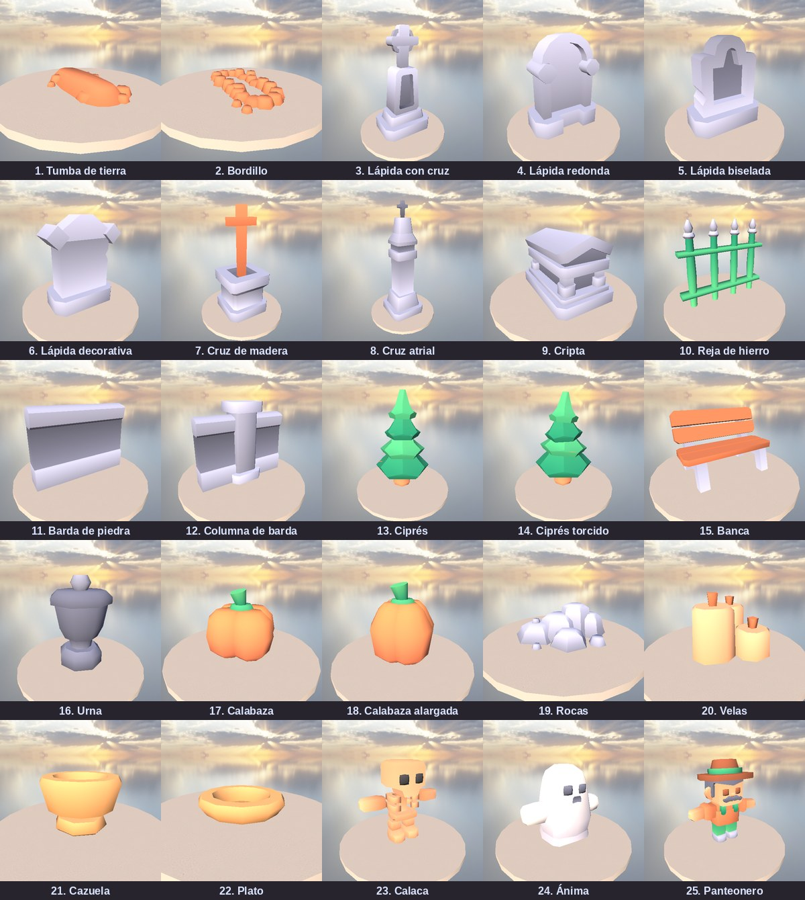

**Figura 7.** Los 25 modelos de librería vistos en la galería del programa.

## 7. Modelado jerárquico

### 7.1 Jerarquías dentro de los modelos

Los modelos que tendrán partes móviles se construyeron como jerarquías de nodos (Figura 8). Cada
nodo hijo guarda su transformación relativa a su padre y su origen se colocó en la articulación:
la banderita gira sobre el cordel, el ala sobre el eje del cuerpo, la hoja de la reja sobre su
bisagra y la lámpara sobre el gancho del brazo.

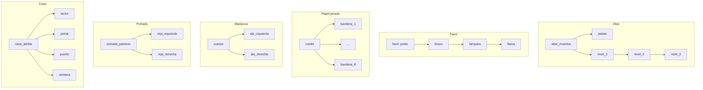
```mermaid
flowchart TB
    subgraph Altar
        A0[altar_muertos] --> A1[petate]
        A0 --> N1[nivel_1] --> N2[nivel_2] --> N3[nivel_3]
    end
    subgraph Farol
        F0[farol: poste] --> F1[brazo] --> F2[lampara] --> F3[llama]
    end
    subgraph Papel_picado[Papel picado]
        P0[cordel] --> P1[bandera_1]
        P0 --> P2[...]
        P0 --> P8[bandera_8]
    end
    subgraph Mariposa
        M0[cuerpo] --> M1[ala_izquierda]
        M0 --> M2[ala_derecha]
    end
    subgraph Portada
        E0[entrada_panteon] --> E1[reja_izquierda]
        E0 --> E2[reja_derecha]
    end
    subgraph Casa
        C0[casa_adobe] --> C1[techo]
        C0 --> C2[portal]
        C0 --> C3[puerta]
        C0 --> C4[ventana]
    end
```

**Figura 8.** Jerarquías de nodos de los modelos propios articulados.

### 7.2 Grafo de escena

Al cargar un modelo, el programa replica su jerarquía glTF como nodos editables
(`Escena::replicar`) debajo de un **nodo de colocación** que fija su posición, orientación y escala
en la escena. Las ofrendas se cuelgan del nivel del altar en el que descansan, de modo que mover
la casa mueve la ofrenda, mover el altar mueve sus ofrendas y mover un nivel mueve lo que está
sobre él (Figura 9).

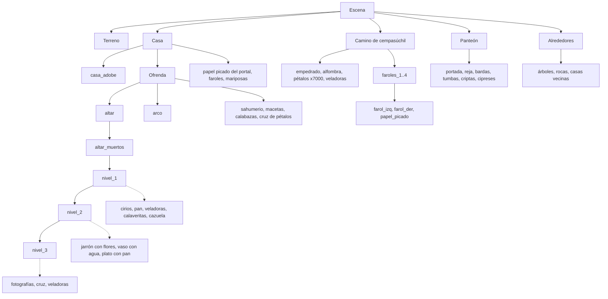
```mermaid
flowchart TB
    R[Escena] --> T[Terreno]
    R --> CA[Casa] --> CS[casa_adobe]
    CA --> OF[Ofrenda] --> AL[altar] --> AM[altar_muertos] --> L1[nivel_1]
    L1 --> L2[nivel_2] --> L3[nivel_3]
    L1 -.-> O1[cirios, pan, veladoras, calaveritas, cazuela]
    L2 -.-> O2[jarrón con flores, vaso con agua, plato con pan]
    L3 -.-> O3[fotografías, cruz, veladoras]
    OF --> AR[arco] 
    OF --> PI[sahumerio, macetas, calabazas, cruz de pétalos]
    CA --> PP[papel picado del portal, faroles, mariposas]
    R --> CM[Camino de cempasúchil] --> EM[empedrado, alfombra, pétalos x7000, veladoras]
    CM --> FA[faroles_1..4] --> FX[farol_izq, farol_der, papel_picado]
    R --> PA[Panteón] --> PO[portada, reja, bardas, tumbas, criptas, cipreses]
    R --> AL2[Alrededores] --> AX[árboles, rocas, casas vecinas]
```

**Figura 9.** Estructura simplificada del grafo de escena (553 nodos).

En el programa, el panel *Jerarquía de la escena* muestra este árbol con colores según el origen
del modelo (propio, librería, procedural o grupo) y se despliega solo hasta el nodo
seleccionado (Figura 10).

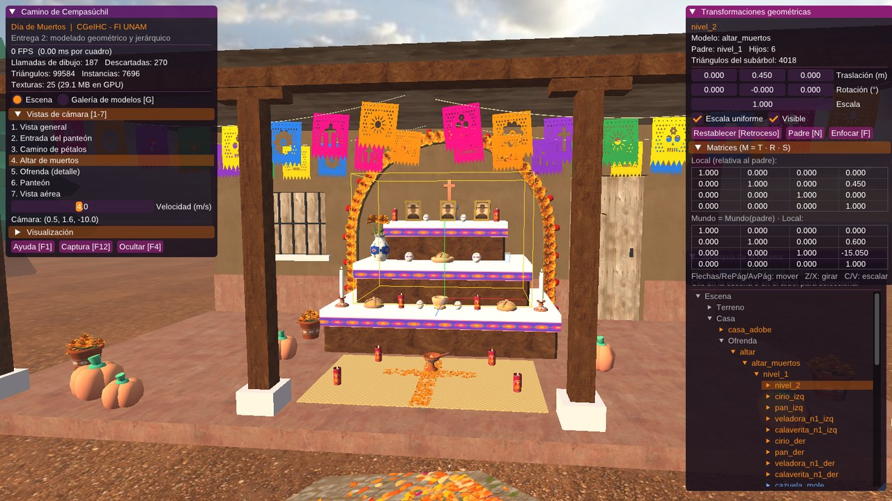

**Figura 10.** Selección del nodo `nivel_2` del altar: caja envolvente y ejes locales en la vista
3D, inspector de transformaciones con sus matrices y árbol de la jerarquía.

## 8. Transformaciones geométricas

Cada nodo guarda una traslación **t**, una rotación en ángulos de Euler (grados, aplicados en
orden X → Y → Z y convertidos a cuaternión) y una escala **s**. Su matriz local se compone como

$$M_{local} = T(\mathbf{t}) \cdot R(\theta_x, \theta_y, \theta_z) \cdot S(\mathbf{s})$$

y la de mundo se obtiene al recorrer el árbol desde la raíz:

$$M_{mundo}(n) = M_{mundo}(\text{padre}(n)) \cdot M_{local}(n)$$

Las normales se transforman con la inversa transpuesta de la parte 3 × 3 de la matriz de mundo,
para que sigan siendo perpendiculares a la superficie aun con escala no uniforme. Al exportar,
Blender convierte su sistema Z-arriba al Y-arriba de glTF, que es el mismo de OpenGL.

Para seleccionar un objeto con el ratón se construye un rayo desde la cámara invirtiendo la
matriz de proyección por vista; el rayo se lleva al espacio local de cada malla con la inversa de
su matriz de mundo, se descarta primero con la caja envolvente (método de las placas) y después
se prueba contra cada triángulo con el algoritmo de Möller y Trumbore (1997). La selección sube
hasta el nodo de colocación del modelo; con `Ctrl` + clic se conserva la pieza exacta.

El inspector (Figura 10) permite modificar los nueve valores arrastrándolos con el ratón o con el
teclado: las flechas y `RePág`/`AvPág` trasladan el objeto en el espacio de la cámara (el
desplazamiento se convierte al espacio del padre con la inversa de su matriz de mundo), `Z`/`X`
lo rotan y `C`/`V` lo escalan; `Retroceso` restablece la transformación original. Ejemplos
útiles para comprobar la jerarquía: rotar `reja_izquierda` sobre Y abre la reja sobre su bisagra;
rotar `brazo` de un farol hace girar también la lámpara y su flama; escalar `Ofrenda` escala el
altar con todas sus ofrendas.

Para los objetos instanciados la matriz de cada copia se arma en el *vertex shader*:

$$M = M_{mundo}(\text{dueño del lote}) \cdot M_{instancia} \cdot M_{nodo\ en\ el\ modelo}$$

## 9. Modelado procedural de la escena

**Camino.** La ruta se define con siete puntos de control y se interpola con una spline
Catmull-Rom **centrípeta** (α = 0.5), que pasa por todos los puntos sin formar lazos ni cúspides
(Catmull y Rom, 1974; Yuksel et al., 2011). Se evalúa con el algoritmo piramidal de Barry y
Goldman (1988) y luego se re-muestrea por longitud de arco, de modo que `punto(s)` y
`tangente(s)` se consultan en metros recorridos. Sobre ella se generan, en código:

- la franja de **empedrado** (2.7 m de ancho, 2 triángulos por tramo de 25 cm, extremos angostados);
- la **alfombra de pétalos**: una franja de 2 m con una textura de recorte alfa en la que la
  densidad de pétalos decrece del centro a las orillas;
- **7 000 pétalos 3D** con desplazamiento lateral de distribución normal (σ = 0.36 m), giro e
  inclinación aleatorios y un 5 % teñido de rojo de mano de león;
- **veladoras** cada 2.2 m a ambos lados, cuatro pares de **faroles** y una tira de **papel picado**
  entre cada par, orientados con la tangente y la normal del camino.

Todo usa un generador pseudoaleatorio con semilla fija, así que la escena es idéntica en cada
ejecución. La Figura 11 muestra el resultado.

**Figura 11.** Vista 3: camino de cempasúchil con alfombra de pétalos, pétalos instanciados,
veladoras, faroles y papel picado; al fondo, la ofrenda.

## 10. Optimización de recursos

**Tabla 6.** Técnicas de optimización y su efecto medido.

| Técnica | Efecto |
|---|---|
| Modelos *low-poly* con densidad de malla según su tamaño en pantalla | 18 modelos propios = 13 382 triángulos. Un solo ojo de la calaverita del prototipo tenía 720 triángulos; la calaverita completa tiene 320 |
| Dibujo instanciado (`glDrawElementsInstanced`) | 7 000 pétalos en **1** llamada en lugar de 7 000; en total 7 988 instancias y entre 118 y 459 llamadas de dibujo por cuadro |
| Combinación de mallas estáticas | Las más de 100 flores y pompones del arco y las 7 flores de cada maceta se dibujan con una llamada por material |
| Texturas compartidas con caché | 25 texturas para 46 modelos; los 25 modelos de Kenney usan una sola paleta de 512 × 512 |
| Texturas pequeñas y comprimidas | 128 a 512 píxeles, JPEG para las opacas: 1.9 MB en disco para 24 texturas; skybox de 6 × 512² en 100 KB |
| glTF con texturas externas | Ninguna textura se duplica dentro de los modelos; 18 modelos propios = 710 KB |
| Índices de 16 bits | Mitad de memoria de índices en todas las mallas de menos de 65 536 vértices |
| Descarte por volumen de visión | Esferas envolventes contra los 6 planos del *frustum* (Gribb y Hartmann, 2001): hasta 341 primitivas descartadas por cuadro |
| Orden de dibujo | Opacos agrupados por textura; el cielo se dibuja después de los opacos para que solo se sombree donde no hay geometría; transparentes de atrás hacia adelante |
| Caras ocultas eliminadas | Se omiten bases y caras interiores (p. ej. cara inferior de los niveles del altar) y se usa *backface culling* salvo en materiales de doble cara |
| Dependencias mínimas | GLAD solo con OpenGL 3.3 core (108 KB en vez de 915 KB); stb solo con PNG y JPEG; enlace estático: el .exe no necesita DLL |
| Sincronía vertical | Evita dibujar más cuadros de los que muestra el monitor |

Resultados medidos con el renderizador por software *llvmpipe* (sin tarjeta gráfica, 4 núcleos):
carga de todos los modelos y texturas en 0.2 a 0.4 s y entre 17 y 30 cuadros por segundo a
1280 × 720; con una tarjeta gráfica real el programa queda limitado por la sincronía vertical.
El paquete completo ocupa unos 7 MB (ejecutable de 2.7 MB y recursos de 4 MB).

## 11. Pruebas internas

**Tabla 7.** Pruebas internas realizadas.

| Prueba | Procedimiento | Resultado |
|---|---|---|
| Compilación en Linux | GCC 13 + CMake, `-Wall -Wextra` | Correcta, sin advertencias en el código del proyecto |
| Compilación para Windows | MinGW-w64 13 (compilación cruzada) | `CaminoCempasuchil.exe` de 64 bits, solo depende de DLL del sistema |
| Ejecución en Windows | El .exe anterior en Wine 9 desde una carpeta con acento (`Camino de Cempasúchil`) | Carga correcta de modelos, texturas y fuente; rutas UTF-8 resueltas |
| Visual Studio 2022 | Abrir la carpeta con CMake y compilar x64-Release | Pendiente de confirmar en los equipos del equipo |
| Carga de modelos | Registro de modelos sin uso al iniciar | 46 modelos cargados, todos usados en la escena |
| Exportación glTF | Lectura de los 18 archivos con cgltf y con el inventario | Jerarquías, UVs, materiales y rutas de textura correctas |
| Vistas | Capturas automáticas de las 7 vistas (`tools/capturar_figuras.sh`) | Sin objetos atravesando la cámara ni huecos visibles |
| Interacción | Clics y teclas simulados con `xdotool`: selección por rayo, transformación, galería, alambre, capturas | Funcionan; la prueba rayo-triángulo elige el objeto visible (con cajas envolventes se elegía la casa al hacer clic en el altar) |
| Rendimiento | 120 cuadros por vista con *llvmpipe* | 17 a 30 FPS sin GPU |

## 12. Resultados

Las Figuras 12 a 17 muestran el programa en las vistas predefinidas y la Figura 18 el modo de
malla de alambre que permite revisar la topología de todos los modelos dentro de la escena.

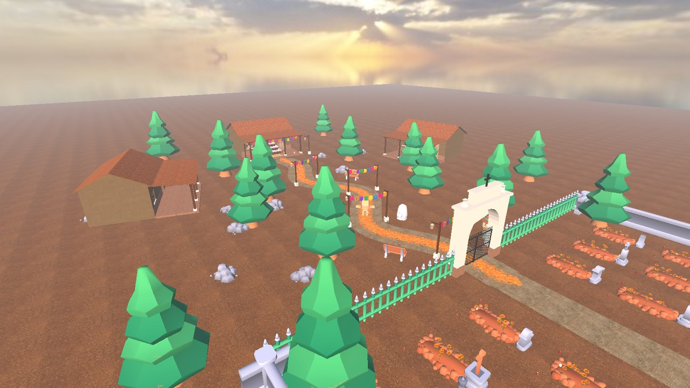

**Figura 12.** Vista 1, general: el pueblo con la casa, el camino y el panteón.

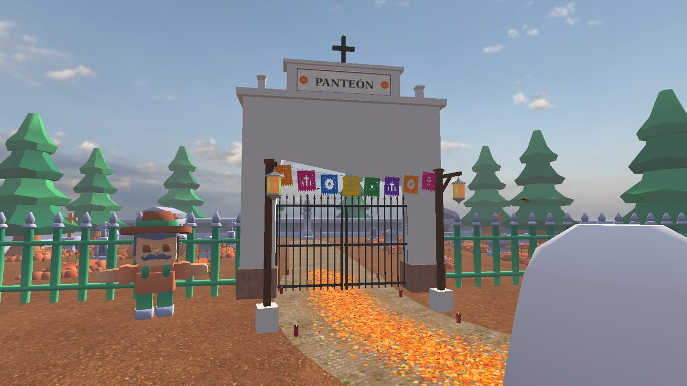

**Figura 13.** Vista 2, entrada del panteón con la portada, la reja, el panteonero y el primer
par de faroles.

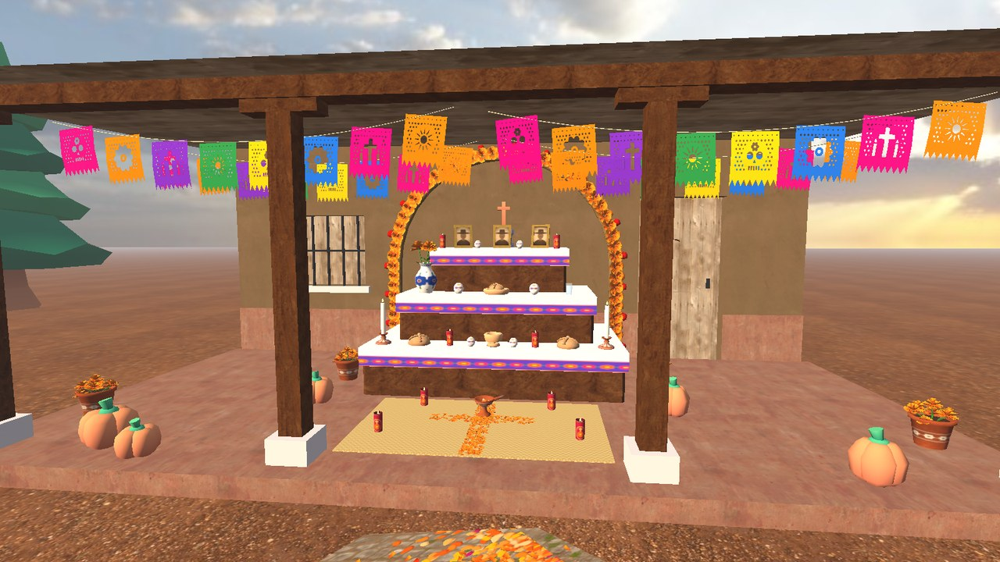

**Figura 14.** Vista 4, la casa de adobe con la ofrenda bajo el portal y el papel picado.

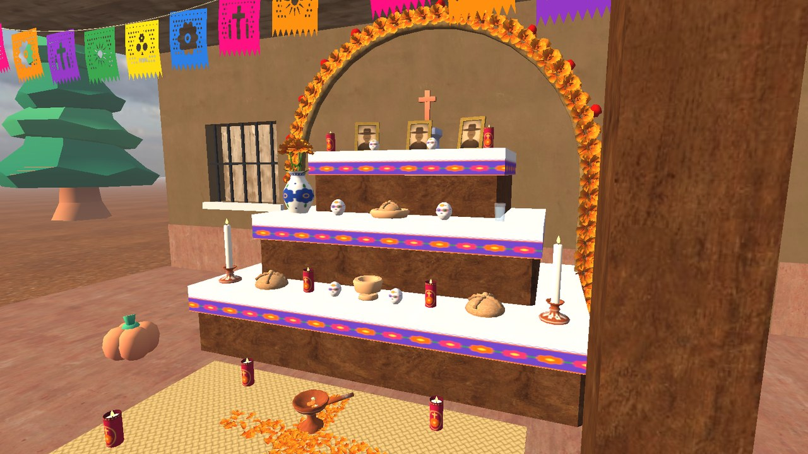

**Figura 15.** Vista 5, detalle de la ofrenda: fotografías, cruz, jarrón con cempasúchil, vaso
con agua, pan de muerto, calaveritas, cirios, veladoras, sahumerio y cruz de pétalos.

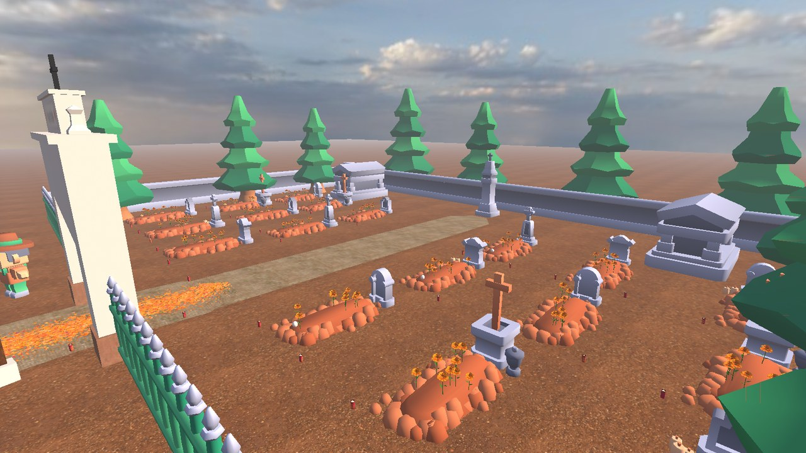

**Figura 16.** Vista 6, el panteón con tumbas adornadas con flores y veladoras, criptas y cruz
atrial.

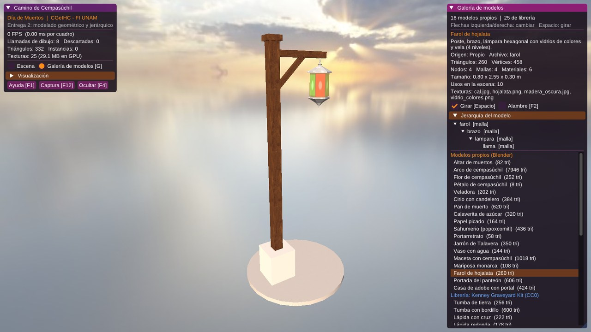

**Figura 17.** Galería de modelos: el farol sobre el pedestal giratorio, sus datos y su
jerarquía de cuatro niveles.

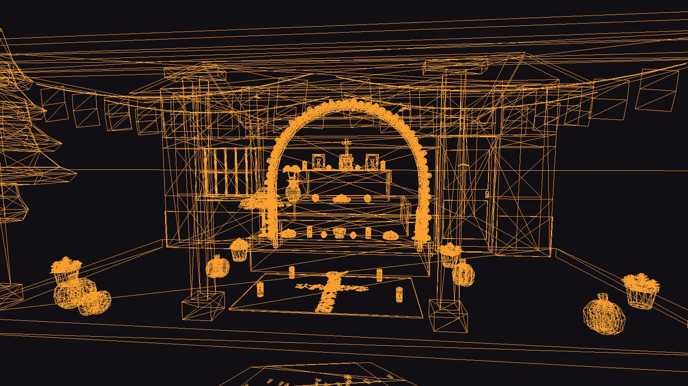

**Figura 18.** Modo de malla de alambre (`F2`) en la vista del altar.

## 13. Trabajo para las siguientes entregas

**Tabla 8.** Pendientes del documento de especificaciones y cómo los facilita esta entrega.

| Requisito | Entrega | Base ya preparada |
|---|---|---|
| Phong (opacos) y Fresnel (translúcidos y metálicos) | 3 | Materiales con metálico, rugosidad y modo alfa (vidrio, agua, hojalata, hierro) |
| Texturizado de ambiente (cube mapping) | 3 | Skybox con cube map ya integrado |
| 2 interacciones con luces en tiempo real | 3 | Flamas como nodos propios en veladoras, cirios y faroles (posición de las luces puntuales) |
| 2 animaciones de huesos | 4 | Personajes jerárquicos de Kenney con 32 animaciones; mariposa con alas articuladas para armarle esqueleto |
| 3 animaciones por código | 4 | Pivotes para el aleteo de la mariposa, el viento en el papel picado y el parpadeo de las flamas |
| 3 animaciones de software externo | 4 | Blender con *scripts*: apertura de reja, puerta y balanceo de farol como *keyframes* glTF |
| 8 animaciones por entrada del usuario | 4 | Selección y teclado ya conectados al grafo de escena |
| Validación con usuarios | 4 a 7 de la metodología | Interfaz con ayuda y vistas guiadas para las pruebas |
| Ejecutable empaquetado (.exe con InstallForge) | Final | El .exe se genera con `assets/`, `shaders/` y `readme.txt` junto a él |

## 14. Referencias

- Akenine-Möller, T., Haines, E., Hoffman, N., Pesce, A., Iwanicki, M., & Hillaire, S. (2018).
  *Real-time rendering* (4th ed.). CRC Press.
- Barry, P. J., & Goldman, R. N. (1988). A recursive evaluation algorithm for a class of
  Catmull-Rom splines. *ACM SIGGRAPH Computer Graphics, 22*(4), 199–204.
- Blender Foundation. (2026). *Blender* (Versión 5.2) [Software]. https://www.blender.org
- Brandes, S. (2006). *Skulls to the living, bread to the dead: The Day of the Dead in Mexico and
  beyond*. Blackwell.
- Catmull, E., & Rom, R. (1974). A class of local interpolating splines. En R. E. Barnhill & R.
  F. Riesenfeld (Eds.), *Computer aided geometric design* (pp. 317–326). Academic Press.
- Cornut, O. (2025). *Dear ImGui* (Versión 1.91.9b) [Software]. https://github.com/ocornut/imgui
- de Vries, J. (2020). *Learn OpenGL: Learn modern OpenGL graphics programming in a step-by-step
  fashion*. Kendall & Welling.
- Gribb, G., & Hartmann, K. (2001). *Fast extraction of viewing frustum planes from the
  world-view-projection matrix* [Nota técnica].
- Hughes, J. F., van Dam, A., McGuire, M., Sklar, D. F., Foley, J. D., Feiner, S. K., & Akeley,
  K. (2014). *Computer graphics: Principles and practice* (3rd ed.). Addison-Wesley.
- Kenney. (2025). *Graveyard Kit* (Versión 5.0) [Modelos 3D, CC0].
  https://kenney.nl/assets/graveyard-kit
- Möller, T., & Trumbore, B. (1997). Fast, minimum storage ray-triangle intersection. *Journal
  of Graphics Tools, 2*(1), 21–28.
- Poly Haven. (s. f.). *Textures and HDRIs* [Recursos CC0]. https://polyhaven.com
- Segal, M., & Akeley, K. (2010). *The OpenGL graphics system: A specification (Version 3.3,
  core profile)*. The Khronos Group.
- The Khronos Group. (2021). *glTF 2.0 specification*.
  https://registry.khronos.org/glTF/specs/2.0/glTF-2.0.html
- UNESCO. (2008). *Indigenous festivity dedicated to the dead*. Representative List of the
  Intangible Cultural Heritage of Humanity. https://ich.unesco.org/en/RL/indigenous-festivity-dedicated-to-the-dead-00054
- Yuksel, C., Schaefer, S., & Keyser, J. (2011). Parameterization and applications of
  Catmull–Rom curves. *Computer-Aided Design, 43*(7), 747–755.

---

## Anexo A. Fichas de los modelos propios

Cada figura muestra el render con textura (izquierda) y la malla de alambre sobre material de
arcilla (derecha), generados por `construir_modelos.py`.

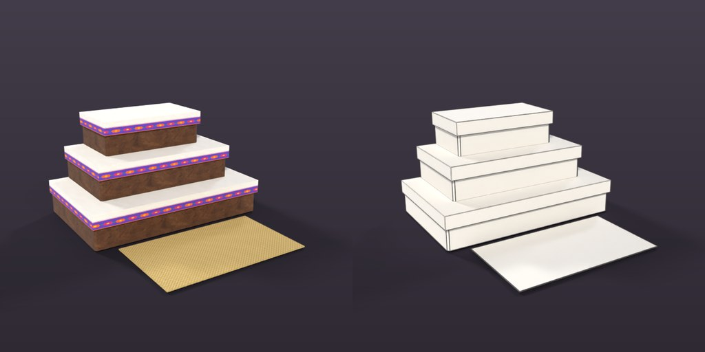

**Figura A1.** Altar de muertos (82 triángulos): tres niveles escalonados de madera biselada con
mantel bordado; cada nivel es hijo del anterior. Incluye el petate.

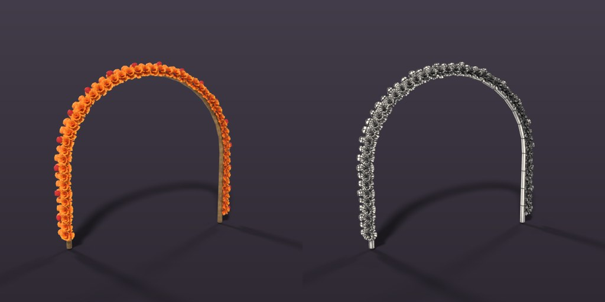

**Figura A2.** Arco de cempasúchil (7 946 triángulos): carrizo barrido sobre postes y medio
punto, con flores de cempasúchil, pompones de relleno y mano de león combinados en una malla.

**Figura A3.** Flor de cempasúchil (252 triángulos): 39 pétalos en cuatro anillos de elevación
creciente, botón central, cáliz, tallo curvo y dos hojas.

**Figura A4.** Pétalo de cempasúchil (8 triángulos): tarjeta curvada en forma de cuchara.

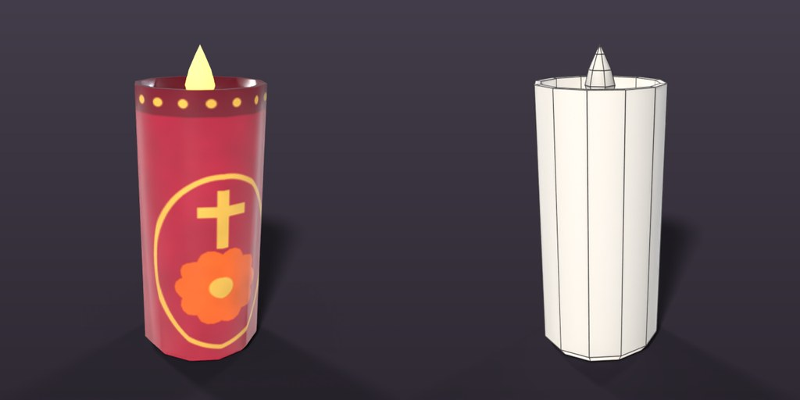

**Figura A5.** Veladora (202 triángulos): vaso torneado con impresión, borde e interior, cera,
mecha y flama emisiva como nodo propio.

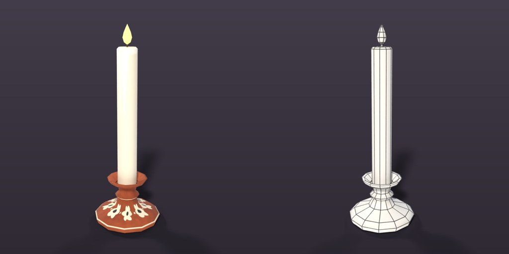

**Figura A6.** Cirio con candelero (384 triángulos): candelero de barro torneado, vela con
escurrimientos y flama (jerarquía de cuatro nodos).

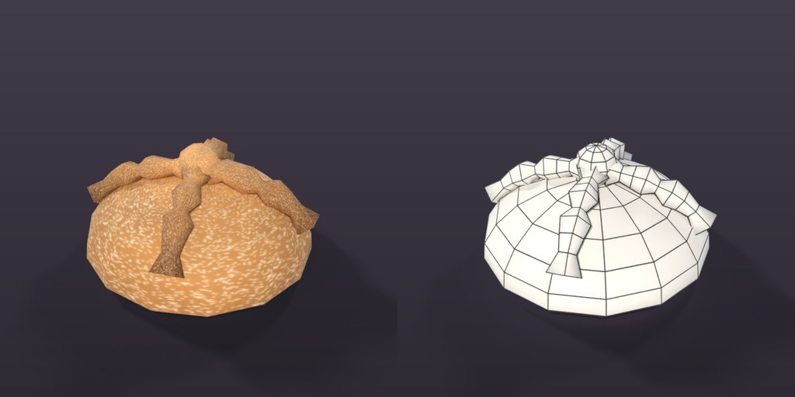

**Figura A7.** Pan de muerto (620 triángulos): domo torneado, cuatro huesitos barridos con radio
ondulado y bolita superior en una sola malla.

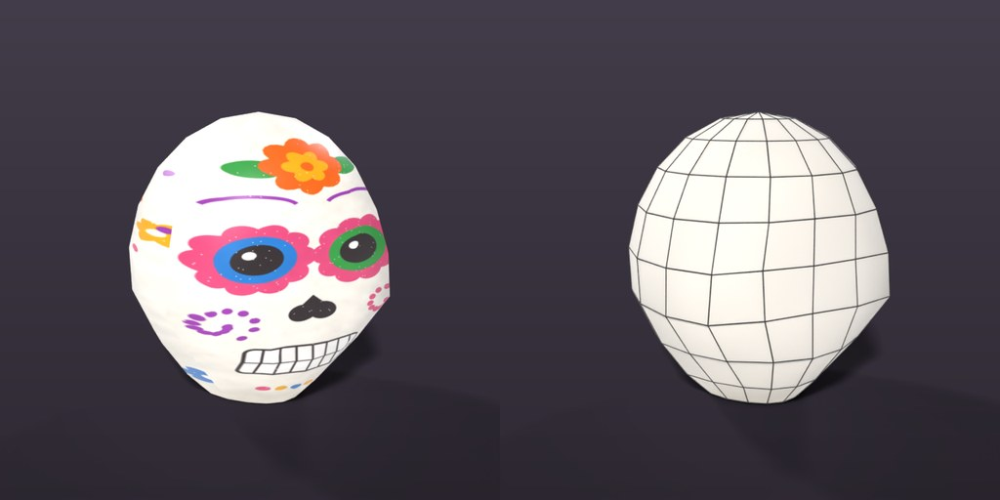

**Figura A8.** Calaverita de azúcar (320 triángulos): esfera deformada (mandíbula, pómulos,
cuencas) con textura alineada mediante proyección frontal.

**Figura A9.** Papel picado (164 triángulos): cordel en catenaria y ocho banderitas con pivote en
el cordel; cuatro diseños calados en una textura con recorte alfa.

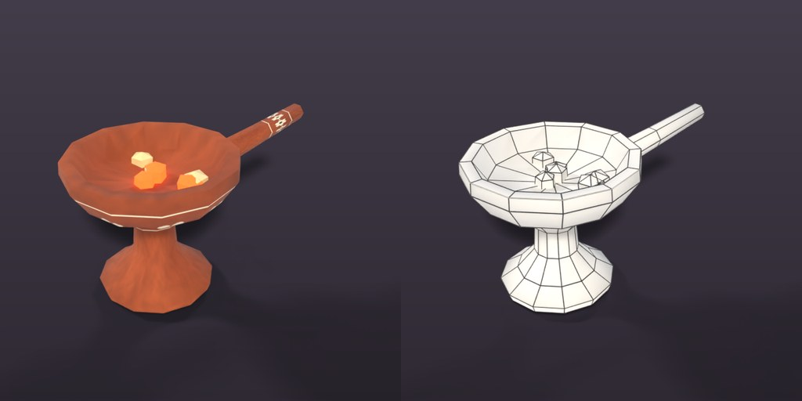

**Figura A10.** Sahumerio (436 triángulos): copalero de barro con mango, brasas emisivas y copal.

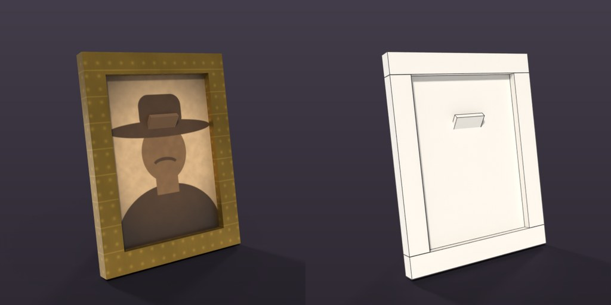

**Figura A11.** Portarretrato (58 triángulos): marco de hojalata repujada, fotografía y pata.

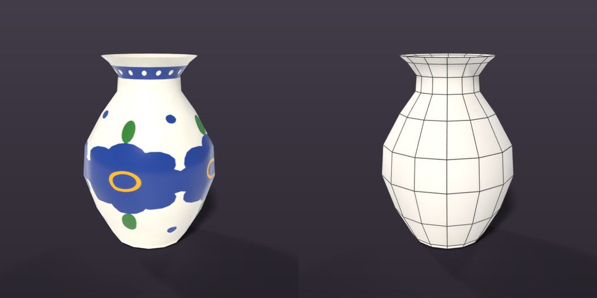

**Figura A12.** Jarrón de Talavera (350 triángulos): superficie de revolución con textura de
Talavera poblana.

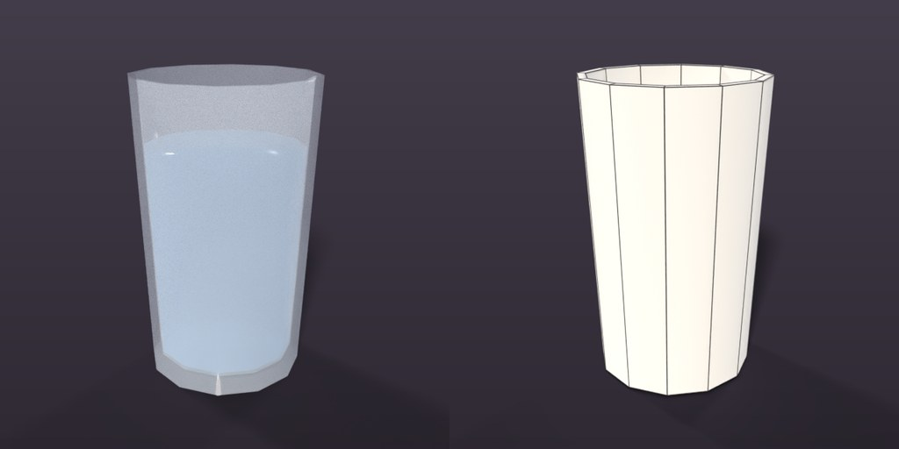

**Figura A13.** Vaso con agua (144 triángulos): vidrio y agua con transparencia por mezcla alfa.

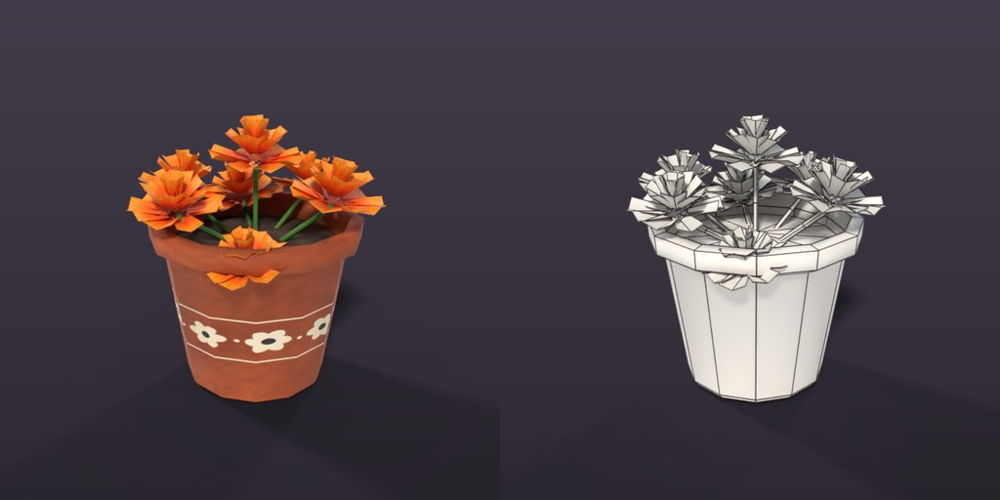

**Figura A14.** Maceta con cempasúchil (1 018 triángulos): maceta de barro y siete flores
combinadas en una malla.

**Figura A15.** Mariposa monarca (108 triángulos): cuerpo torneado, antenas y alas articuladas
con recorte alfa.

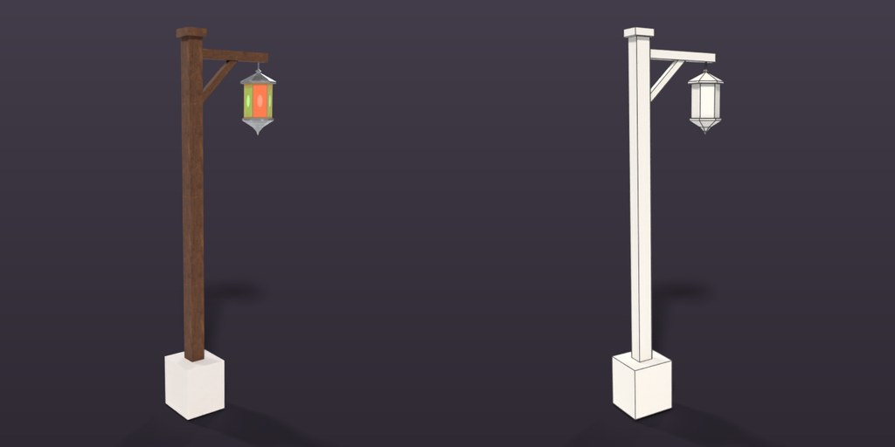

**Figura A16.** Farol de hojalata (260 triángulos): poste con base de mampostería, brazo con
tornapunta, lámpara hexagonal con vidrios de colores y vela.

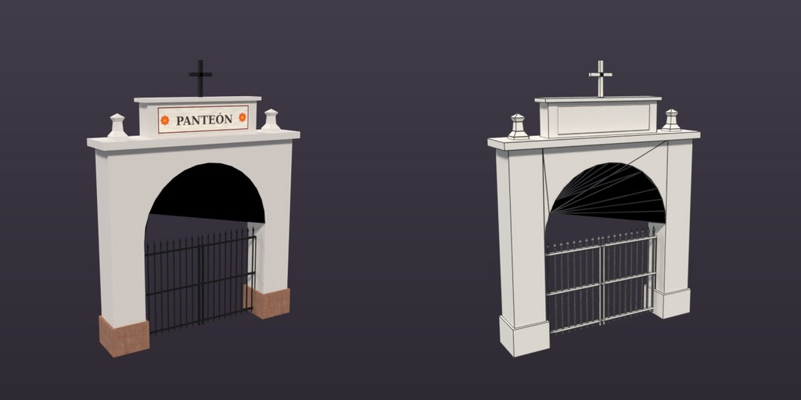

**Figura A17.** Portada del panteón (606 triángulos): pilastras con zócalo, muro con arco de
medio punto extruido, cornisa, ático con letrero, remates, cruz y reja de dos hojas con
bisagras.

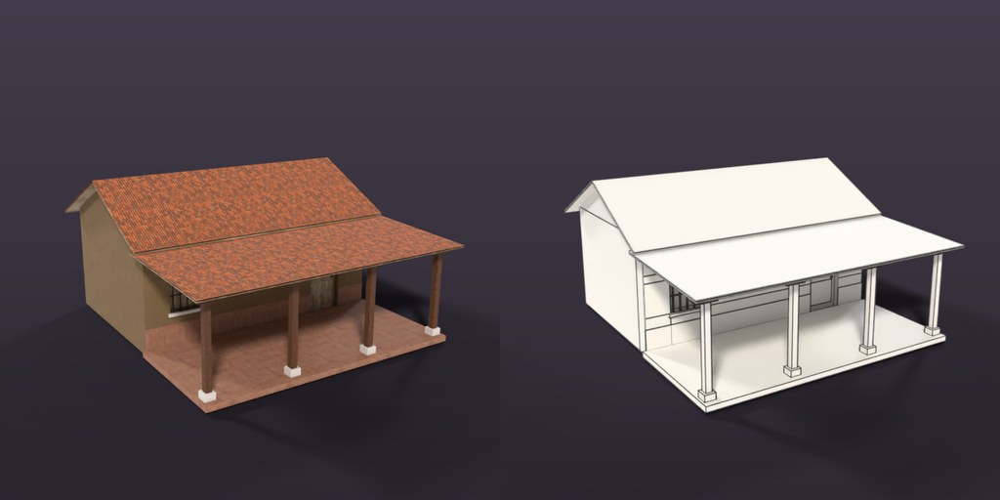

**Figura A18.** Casa de adobe (424 triángulos): muros con vanos, hastiales, guardapolvo rojo,
techo de teja a dos aguas, portal con horcones y viga madrina, puerta y ventana con herrería.
